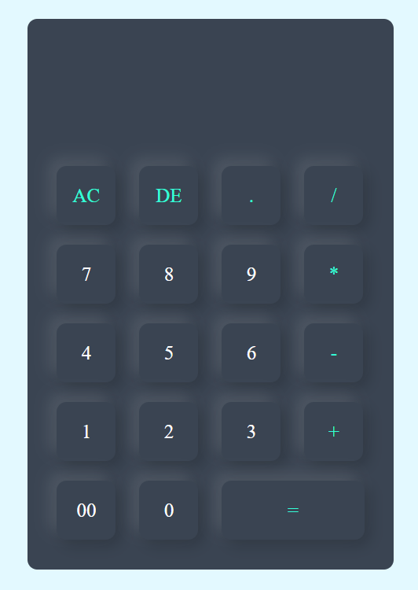

# 🔢 JavaScript Calculator
A clean, functional, and modern calculator built using **HTML**, **CSS**, and **JavaScript**. This project demonstrates basic front-end web development concepts while delivering a fully operational calculator UI.

## 🚀 Features
- 🧮 Basic arithmetic operations: `+`, `-`, `×`, `÷`
- 🔄 All Clear (`AC`) and Delete (`DE`) functions
- ✅ Real-time input/output update
- 💠 Decimal support
- 🔢 Double zero (`00`) button
- 🎨 Responsive and stylish UI with neumorphic design

## 🖼️ Preview
 

## 🛠️ Technologies Used
HTML5 – Markup for structure
CSS3 – Styling with a neumorphic touch
JavaScript (Vanilla) – Logic for calculation and interactivity

## 💡 Inspiration
This project is great for beginners looking to understand:
1) DOM manipulation with JavaScript
2) Event handling
3) Responsive layout using CSS Flexbox
4) Inline JavaScript for real-time interaction

## 🙌 Acknowledgements
Contributions and improvements are always welcome! Feel free to fork or enhance this project.
Made with ❤️ using HTML, CSS, and JavaScript.

